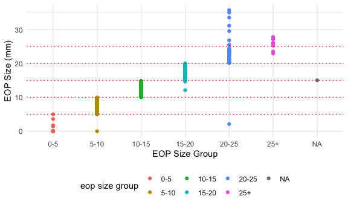

p8105\_mtp\_tk2886
================
Tanvir Khan
2021-10-21

# Problem 1

### Loading the p8105\_mtp\_data.xlsx data set and cleaning the data set

``` r
mtp_df <-
  read_excel(
    "./data/p8105_mtp_data.xlsx",
    sheet = "this one",
    range = "A9:I1230") %>%
  janitor::clean_names()
```

### Replacing numerical codes with the real representation and converting data types to the correct data types and arranging the table by gender and age.

``` r
eop_dfc <- 
  mtp_df %>%
  mutate(
     sex = recode(sex, 
                  "0" = "female", 
                  "1" = "male"),
     sex = factor(sex, levels = c(
                    "female",
                    "male")), 
     age_group = recode(age_group,
                       "2" = "18-30", 
                       "3" = "31-40", 
                       "4" = "41-50",
                       "5" = "51-60", 
                       "6" = "60+",
                       "7" = "60+", 
                       "8" = "60+"), 
     age_group = factor(age_group, levels = c(
                    "18-30", 
                    "31-40",
                    "41-50", 
                    "51-60",
                    "60+")),
    eop_size_mm = replace(eop_size_mm, is.na(eop_size_mm), "0"),
    eop_size = recode(eop_size,
                      "0" = "0-5",
                      "1" = "5-10",
                      "2" = "10-15",
                      "3" = "15-20",
                      "4" = "20-25",
                      "5" = "25+"
                      ),
    eop_size = factor(eop_size, levels = c(
                      "0-5",
                      "5-10",
                      "10-15",
                      "15-20",
                      "20-25",
                      "25+")), 
    eop_visibility_classification = recode(eop_visibility_classification,
                      "0" = "eop size 0 mm",
                      "1" = "0 < eop size mm <= 5",
                      "2" = "eop size >= 5 mm"),
    eop_visibility_classification = factor(eop_visibility_classification, levels = c(
                    "eop size 0 mm",
                    "0 < eop size mm <= 5",
                    "eop size >= 5 mm")),
    fhp_category = recode(fhp_category,
                          "0" = "0-10",
                          "1" = "10-20",
                          "2" = "20-30",
                          "3" = "30-40",
                          "4" = "40-50",
                          "5" = "50-60",
                          "6" = "60-70",
                          "7" = "70-80"),
    fhp_category = factor(fhp_category, levels = c(
                           "0-10",
                           "10-20",
                           "20-30",
                           "30-40",
                           "40-50",
                           "50-60",
                           "60-70",
                           "70-80"
    )), 
    age = as.integer(age),
    eop_size_mm = as.double(eop_size_mm)) %>%
  arrange(sex, age)
```

``` r
eop_dim <- eop_dfc %>%
  dim()

eop_row <- eop_dfc %>%
  nrow()

eop_col <- eop_dfc %>%
  ncol()

eop_key_var <- eop_dfc %>%
  names()
```

The research report describes the relationship between posture and
“enlarged protuberances”, especially among younger subjects (however
there are older aged participants) The research article is one of the
article from 2018, Nature Scientific Reports. Originally, the dataset
that was given and loaded had 1,221 participants. I have noticed in the
abstract of the report, the researcher mentions that n = 1200, but there
is 1,221 participants in our dataset.

After analyzing one of the 2018 Nature Scientific Report that describes
the relationship between posture and “enlarged protuberances”,
especially among younger subjects, there are key components that need to
be identified. This data set has **1221**. This data set has **9**. The
number of observations in this research study that is between ages 18-86
is **1221**. The key variables in the dataset are **sex, age,
age\_group, eop\_size\_mm, eop\_size, eop\_visibility\_classification,
eop\_shape, fhp\_size\_mm, fhp\_category**.

``` r
eop_dfc %>% 
  group_by(sex, age_group) %>% 
  summarise(
    frequency = n()) %>% 
  drop_na() %>%
  pivot_wider(
    names_from = sex,
    values_from = frequency) %>% 
  knitr::kable(col.names = c('Age Group', 'Female', 'Male'),
               caption = "**Table1:** Age and Gender Distribution. **Value: *NA*:** Missclassified data")
```

    ## `summarise()` has grouped output by 'sex'. You can override using the `.groups` argument.

| Age Group | Female | Male |
|:----------|-------:|-----:|
| 18-30     |    151 |  152 |
| 31-40     |    102 |  102 |
| 41-50     |    106 |  101 |
| 51-60     |     99 |  101 |
| 60+       |    155 |  150 |

**Table1:** Age and Gender Distribution. **Value: *NA*:** Missclassified
data

**Table1** showcases the age group and gender distribution.

``` r
eop_dfc %>%
  ggplot(aes(x = eop_size, y = eop_size_mm, color = eop_size)) +
  geom_point() +
  geom_hline(yintercept = c(5, 10, 15, 20, 25), color = 'red', linetype = 'dotted') + 
  xlab('EOP Size Group') +
  ylab('EOP Size (mm)') +
  scale_color_hue(name = "eop size group")
```


