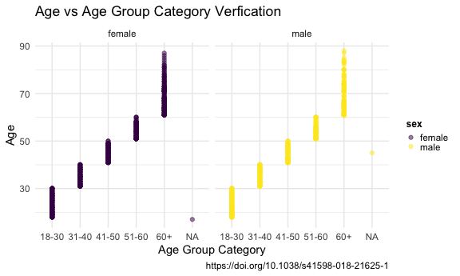
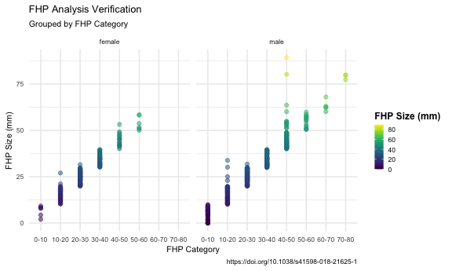
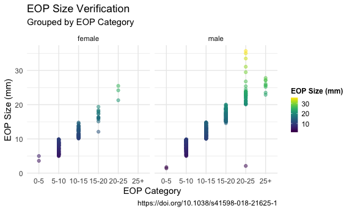
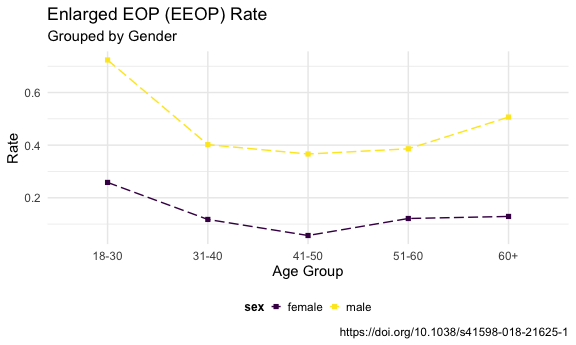
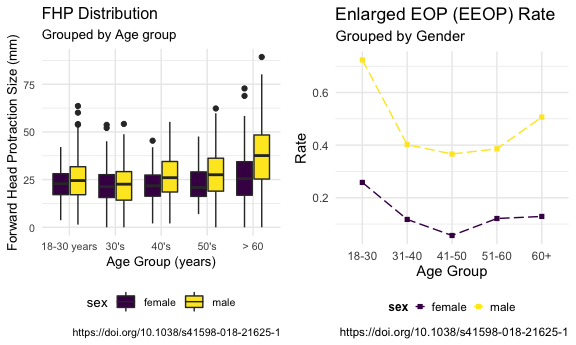

p8105\_mtp\_tk2886
================
Tanvir Khan
2021-10-21

# Problem 1

### Loading the p8105\_mtp\_data.xlsx data set, extracting specific part, cleaning the data set

``` r
mtp_df <-
  read_excel(
    "./data/p8105_mtp_data.xlsx",
    sheet = "this one",
    range = "A9:I1230") %>%
  janitor::clean_names()
```

### Replacing numerical codes with the real representation and converting data types to the correct data types and arranging the table by gender and age (youung to old).

``` r
eop_dfc <- 
  mtp_df %>%
  mutate(
     sex = recode(sex, 
                  "0" = "female", 
                  "1" = "male"),
     sex = factor(sex, levels = c(
                    "female",
                    "male")), 
     age_group = recode(age_group,
                       "2" = "18-30", 
                       "3" = "31-40", 
                       "4" = "41-50",
                       "5" = "51-60", 
                       "6" = "60+",
                       "7" = "60+", 
                       "8" = "60+"), 
     age_group = factor(age_group, levels = c(
                    "18-30", 
                    "31-40",
                    "41-50", 
                    "51-60",
                    "60+")),
    eop_size_mm = replace(eop_size_mm, is.na(eop_size_mm), "0"),
    eop_size = recode(eop_size,
                      "0" = "0-5",
                      "1" = "5-10",
                      "2" = "10-15",
                      "3" = "15-20",
                      "4" = "20-25",
                      "5" = "25+"
                      ),
    eop_size = factor(eop_size, levels = c(
                      "0-5",
                      "5-10",
                      "10-15",
                      "15-20",
                      "20-25",
                      "25+")), 
    eop_visibility_classification = recode(eop_visibility_classification,
                      "0" = "eop size 0 mm",
                      "1" = "0 < eop size mm <= 5",
                      "2" = "eop size >= 5 mm"),
    eop_visibility_classification = factor(eop_visibility_classification, levels = c(
                    "eop size 0 mm",
                    "0 < eop size mm <= 5",
                    "eop size >= 5 mm")),
    fhp_category = recode(fhp_category,
                          "0" = "0-10",
                          "1" = "10-20",
                          "2" = "20-30",
                          "3" = "30-40",
                          "4" = "40-50",
                          "5" = "50-60",
                          "6" = "60-70",
                          "7" = "70-80"),
    fhp_category = factor(fhp_category, levels = c(
                           "0-10",
                           "10-20",
                           "20-30",
                           "30-40",
                           "40-50",
                           "50-60",
                           "60-70",
                           "70-80"
    )), 
    age = as.integer(age),
    eop_size_mm = as.double(eop_size_mm)) %>%
  arrange(sex, age)
```

``` r
eop_dim <- eop_dfc %>%
  dim()

eop_row <- eop_dfc %>%
  nrow()

eop_col <- eop_dfc %>%
  ncol()

eop_key_var <- eop_dfc %>%
  names()
```

``` r
#Code for showing the count of Female and Male in each Age Group 
eop_dfc %>% 
  group_by(sex, age_group) %>% 
  summarise(
    frequency = n()) %>% 
  drop_na() %>%
  pivot_wider(
    names_from = sex,
    values_from = frequency) %>% 
  knitr::kable(col.names = c('Age Group', 'Female', 'Male'),
               caption = "Age and Gender Distribution.")
```

    ## `summarise()` has grouped output by 'sex'. You can override using the `.groups` argument.

| Age Group | Female | Male |
|:----------|-------:|-----:|
| 18-30     |    151 |  152 |
| 31-40     |    102 |  102 |
| 41-50     |    106 |  101 |
| 51-60     |     99 |  101 |
| 60+       |    155 |  150 |

Age and Gender Distribution.

``` r
#Code for showing the total female and male and the percentage of female and male
eop_dfc %>% 
  group_by(sex) %>% 
  summarise(
    frequency = n()) %>%
    mutate(percentage = prop.table(frequency)*100) %>%
  knitr::kable()
```

| sex    | frequency | percentage |
|:-------|----------:|-----------:|
| female |       614 |   50.28665 |
| male   |       607 |   49.71335 |

``` r
#Code for showing the total amount of male and female in each age_group and the respective percentage
eop_dfc %>% 
  group_by(age_group) %>% 
  summarise(
    frequency = n()) %>%
    mutate(percentage = prop.table(frequency)*100) %>%
  knitr::kable()
```

| age\_group | frequency | percentage |
|:-----------|----------:|-----------:|
| 18-30      |       303 | 24.8157248 |
| 31-40      |       204 | 16.7076167 |
| 41-50      |       207 | 16.9533170 |
| 51-60      |       200 | 16.3800164 |
| 60+        |       305 | 24.9795250 |
| NA         |         2 |  0.1638002 |

``` r
eop_dfc %>% 
  group_by(sex, age_group) %>% 
  summarise(
    frequency = n()) %>% 
  pivot_wider(
    names_from = sex,
    values_from = frequency) %>% 
  knitr::kable(col.names = c('Age Group', 'Female', 'Male'),
               caption = "Age and Gender Distribution")
```

| Age Group | Female | Male |
|:----------|-------:|-----:|
| 18-30     |    151 |  152 |
| 31-40     |    102 |  102 |
| 41-50     |    106 |  101 |
| 51-60     |     99 |  101 |
| 60+       |    155 |  150 |
| NA        |      1 |    1 |

Age and Gender Distribution

``` r
eop_dfc %>% 
  group_by(eop_visibility_classification) %>% 
  summarise(
    frequency = n()) %>%
    mutate(percentage = prop.table(frequency)*100) %>%
  knitr::kable()
```

| eop\_visibility\_classification | frequency | percentage |
|:--------------------------------|----------:|-----------:|
| eop size 0 mm                   |       447 |  36.609337 |
| 0 &lt; eop size mm &lt;= 5      |        81 |   6.633907 |
| eop size &gt;= 5 mm             |       693 |  56.756757 |

``` r
eop_dfc %>% 
  group_by(eop_size) %>% 
  summarise(
    frequency = n()) %>%
    mutate(percentage = prop.table(frequency)*100) %>%
  knitr::kable()
```

| eop\_size | frequency | percentage |
|:----------|----------:|-----------:|
| 0-5       |       522 | 42.7518428 |
| 5-10      |       305 | 24.9795250 |
| 10-15     |       227 | 18.5913186 |
| 15-20     |       109 |  8.9271089 |
| 20-25     |        48 |  3.9312039 |
| 25+       |         9 |  0.7371007 |
| NA        |         1 |  0.0819001 |

``` r
eop_dfc %>% 
  group_by(fhp_category) %>% 
  summarise(
    frequency = n()) %>%
    mutate(percentage = prop.table(frequency)*100) %>%
  knitr::kable()
```

| fhp\_category | frequency | percentage |
|:--------------|----------:|-----------:|
| 0-10          |       100 |  8.1900082 |
| 10-20         |       319 | 26.1261261 |
| 20-30         |       408 | 33.4152334 |
| 30-40         |       221 | 18.0999181 |
| 40-50         |       129 | 10.5651106 |
| 50-60         |        30 |  2.4570025 |
| 60-70         |         8 |  0.6552007 |
| 70-80         |         5 |  0.4095004 |
| NA            |         1 |  0.0819001 |

# Creating Plots to verify if the categorical variables follow the rules for their associated data

### Age/Age Group Verification Plot

``` r
eop_dfc %>%
  ggplot(aes(x = age_group, y = age, color = sex)) + 
  geom_point(alpha = 0.5) +
  labs(
    title = "Age vs Age Group Category Verfication",
    x = "Age Group Category",
    y = "Age", 
    caption = "https://doi.org/10.1038/s41598-018-21625-1") +
  theme(legend.position = "right",
        legend.title = element_text(size = 9, face = "bold"),
        legend.key.size = unit(0.3, 'cm')) +
  facet_grid(~sex)
```


### FHP Size/FHP Category Verification Plot

``` r
eop_dfc %>%
  drop_na() %>% 
  ggplot(aes(x = fhp_category, y = fhp_size_mm, color = fhp_size_mm)) +
  geom_point(alpha = 0.5) + 
  labs(
    title = "FHP Analysis Verification",
    subtitle = "Grouped by FHP Category", 
    x = "FHP Category",
    y = "FHP Size (mm)",
    caption = "https://doi.org/10.1038/s41598-018-21625-1") +
  theme(legend.position = "right",
        legend.title = element_text(size = 9, face = "bold"),
        legend.key.size = unit(0.3, 'cm'))
```



### EOP Size Verification

``` r
eop_dfc %>%
  drop_na() %>% 
  ggplot(aes(x = eop_size, y = eop_size_mm, color = eop_size_mm)) +
  geom_point(alpha = 0.5) + 
  labs(
    title = "EOP Size Verification",
    subtitle = "Grouped by EOP Category", 
    x = "EOP Category",
    y = "EOP Size (mm)",
    caption = "https://doi.org/10.1038/s41598-018-21625-1")
```


# Problem 2 - Visualization

``` r
eopdf_boxplot <-
  eop_dfc %>%
  drop_na(age_group, fhp_size_mm) %>%
  ggplot(aes(x = age_group, y = fhp_size_mm, fill = sex)) + 
  geom_boxplot() +
  labs(
    title = "FHP Distribution",
    subtitle = "Grouped by Age group",
    x = "Age Group (years)", 
    y = "Forward Head Protraction Size (mm)",
    caption = "https://doi.org/10.1038/s41598-018-21625-1") + 
  scale_x_discrete(
    labels = c("18-30 years","30's", "40's", "50's", ">60"))
eopdf_boxplot
```



``` r
rate_plot_df <- 
  eop_dfc %>%
  group_by(age_group, sex) %>%
  drop_na(age_group) %>% 
  mutate(
    enlarged_filter = case_when(
      eop_size_mm > 10 ~ 'Enlarged'
     )) %>%
  count(enlarged_filter) %>%
  mutate(rate = prop.table(n)) %>%
  filter(enlarged_filter == "Enlarged") %>%
  ggplot(aes(y = rate, x = age_group, color = sex)) +
  geom_line(linetype = "longdash", aes(group = sex)) +
  geom_point() +
  labs(
    title = "Enlarged EOP (EEOP) Rate", 
    subtitle = "Grouped by Gender",
    x = "Age Group", 
    y = "Rate", 
    caption = "https://doi.org/10.1038/s41598-018-21625-1") + 
  theme(legend.position = "bottom",
        legend.title = element_text(size = 9, face = "bold"),
        legend.key.size = unit(0.3, 'cm')) 

rate_plot_df
```



``` r
grid.arrange(eopdf_boxplot, rate_plot_df, ncol = 2)
```



``` r
eop_dfc %>% 
  drop_na(fhp_size_mm, age_group) %>% 
  ggplot(aes(x = fhp_size_mm, y = eop_size_mm, color = sex)) +
  geom_point() +
  geom_smooth(
    method = "lm", 
    color = 'red',
    se = FALSE) +
  labs(
    x = "FHP Size (mm)", 
    y = "EOP Size (mm)",
    caption = "https://doi.org/10.1038/s41598-018-21625-1") +
  facet_grid(
    sex ~ age_group)
```

    ## `geom_smooth()` using formula 'y ~ x'



# Problem 3

``` r
#Getting the total count of each age group 
eop_dfc %>% 
  filter(age_group != "NA") %>%
  group_by(age_group) %>%
  summarise(Participant_Count = n()) %>%
  knitr::kable(col.names = 
                 c("Age Group",
                   "Participant Count"))
```

| Age Group | Participant Count |
|:----------|------------------:|
| 18-30     |               303 |
| 31-40     |               204 |
| 41-50     |               207 |
| 51-60     |               200 |
| 60+       |               305 |

``` r
#Getting mean and standard deviation 
eop_dfc %>%
  filter(age_group != "NA") %>%
  group_by(sex) %>% 
  summarise(Mean = round(mean(fhp_size_mm, na.rm = TRUE)), 
            Standard_Deviation = sd(fhp_size_mm, na.rm = TRUE)) %>% 
  knitr::kable(
    col.names = c("Sex",
                  "Mean",
                  "Standard Deviation"))
```

| Sex    | Mean | Standard Deviation |
|:-------|-----:|-------------------:|
| female |   24 |           10.62294 |
| male   |   28 |           14.66856 |

``` r
enlarged_participants <- 
  eop_dfc %>%
  filter(eop_size_mm > 10) %>%
  nrow()

Prevalence = (enlarged_participants/nrow(eop_dfc) * 100)

Prevalence %>%
  knitr::kable(
    col.names = c("Prevalence"),
    caption = "Table shows the Prevalence of participants in the sample size with Enlarged External Occipital Protuberance")
```

| Prevalence |
|-----------:|
|   32.10483 |

Table shows the Prevalence of participants in the sample size with
Enlarged External Occipital Protuberance

``` r
total_pop <- 
  eop_dfc %>%
  filter(age > 60 & fhp_size_mm > 40) %>% 
  nrow() 

age_sixty = 
  eop_dfc %>%
  filter(age > 60) %>% 
  nrow()

Prevalence_sixty = (total_pop / age_sixty) * 100
Prevalence_sixty
```

    ## [1] 32.45902
