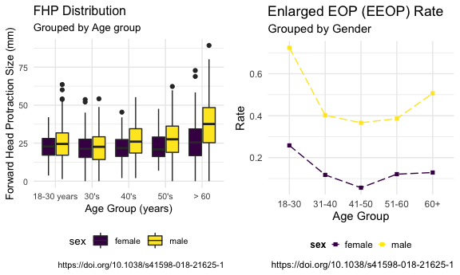
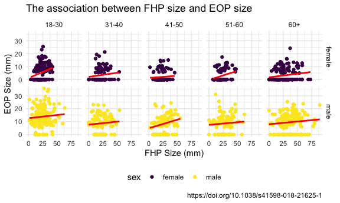

p8105\_mtp\_tk2886
================
Tanvir Khan
2021-10-21

# **Part 1: Introduction**

``` r
#Loading the p8105_mtp_data.xlsx data set, extracting specific part, cleaning the data set
mtp_df <-
  read_excel(
    "./data/p8105_mtp_data.xlsx",
    sheet = "this one",
    range = "A9:I1230") %>%
  janitor::clean_names()
```

#### **Data**

``` r
#Replacing numerical codes with the real representation and converting data types to the correct data types and arranging the table by gender and age (youung to old). 
eop_dfc <- 
  mtp_df %>%
  mutate(
     sex = recode(sex, 
                  "0" = "female", 
                  "1" = "male"),
     sex = factor(sex, 
                  levels = c(
                    "female",
                    "male")), 
     age_group = recode(age_group,
                       "2" = "18-30", 
                       "3" = "31-40", 
                       "4" = "41-50",
                       "5" = "51-60", 
                       "6" = "60+",
                       "7" = "60+", 
                       "8" = "60+"), 
     age_group = factor(age_group, 
                  levels = c(
                    "18-30", 
                    "31-40",
                    "41-50", 
                    "51-60",
                    "60+")),
    eop_size_mm = replace(eop_size_mm, 
                          is.na(eop_size_mm), "0"),
    eop_size = recode(eop_size,
                      "0" = "0-5",
                      "1" = "5-10",
                      "2" = "10-15",
                      "3" = "15-20",
                      "4" = "20-25",
                      "5" = "25+"
                      ),
    eop_size = factor(eop_size, 
                      levels = c(
                      "0-5",
                      "5-10",
                      "10-15",
                      "15-20",
                      "20-25",
                      "25+")), 
    eop_visibility_classification = recode(eop_visibility_classification,
                      "0" = "eop size 0 mm",
                      "1" = "0 < eop size mm <= 5",
                      "2" = "eop size >= 5 mm"),
    eop_visibility_classification = factor(eop_visibility_classification, 
                    levels = c(
                    "eop size 0 mm",
                    "0 < eop size mm <= 5",
                    "eop size >= 5 mm")),
    fhp_category = recode(fhp_category,
                          "0" = "0-10",
                          "1" = "10-20",
                          "2" = "20-30",
                          "3" = "30-40",
                          "4" = "40-50",
                          "5" = "50-60",
                          "6" = "60-70",
                          "7" = "70-80"),
    fhp_category = factor(fhp_category,
                          levels = c(
                           "0-10",
                           "10-20",
                           "20-30",
                           "30-40",
                           "40-50",
                           "50-60",
                           "60-70",
                           "70-80"
    )), 
    age = as.numeric(age),
    eop_size_mm = as.numeric(eop_size_mm),
    eop_shape = as.numeric(eop_shape),
    fhp_size_mm = as.numeric(fhp_size_mm)) %>%
  arrange(sex, age)
```

**Data Cleaning Process:** In order to having meaningful result, I first
organized the data by re-coding the numerical values into meaningful
information that is easier to understand. I converted specific values to
numeric data type so that the numerical data values are not character
data type. I converted the data groups to factor data type since each
group has a fixed number of possible value and anything else will result
in NA. Lastly, I arranged my data by sex and age.

``` r
eop_dim <- eop_dfc %>%
  dim()

eop_row <- eop_dfc %>%
  nrow()

eop_col <- eop_dfc %>%
  ncol()

eop_key_var <- eop_dfc %>%
  names()
```

There are **1221** participants in the study. However **2** of the
participants are not classified correctly. The key variables in this
data set are **sex, age, age\_group, eop\_size\_mm, eop\_size,
eop\_visibility\_classification, eop\_shape, fhp\_size\_mm,
fhp\_category**.

``` r
#Code for Age and Gender Distribution  
gender_count <- 
eop_dfc %>% 
  group_by(age_group, sex) %>% 
  summarise(
    Count = n()) %>% 
  pivot_wider(
    names_from = sex,
    values_from = Count) 

freq_agegrp <- 
  eop_dfc %>% 
  group_by(age_group) %>% 
  summarise(
    frequency = n()) %>%
    mutate(percentage = prop.table(frequency)*100) 


Age_gender_Distribution <-
  left_join(gender_count, freq_agegrp, by = c("age_group" = "age_group")) %>%
  knitr::kable(col.names = c(
    "Age Group", "Female", "Male", "Frequency", "Percentage"),
    caption = 
         "There are **303** people in the **18-30 age group** with 151 female and 152 male. There are **204 people** in the **31-40 age group** with 102 female and 102 male. There are **207 people** in the **41-50 age group** with 106 female and 101 male. There are **200 people** in the **51-60 age group** with 99 female and 101 male. There are **305 people** in the **60+ age group** with 155 female and 150 male.")

Age_gender_Distribution
```

| Age Group | Female | Male | Frequency | Percentage |
|:----------|-------:|-----:|----------:|-----------:|
| 18-30     |    151 |  152 |       303 | 24.8157248 |
| 31-40     |    102 |  102 |       204 | 16.7076167 |
| 41-50     |    106 |  101 |       207 | 16.9533170 |
| 51-60     |     99 |  101 |       200 | 16.3800164 |
| 60+       |    155 |  150 |       305 | 24.9795250 |
| NA        |      1 |    1 |         2 |  0.1638002 |

There are **303** people in the **18-30 age group** with 151 female and
152 male. There are **204 people** in the **31-40 age group** with 102
female and 102 male. There are **207 people** in the **41-50 age group**
with 106 female and 101 male. There are **200 people** in the **51-60
age group** with 99 female and 101 male. There are **305 people** in the
**60+ age group** with 155 female and 150 male.

``` r
#Code for showing the total female and male and the percentage of female and male
eop_dfc %>% 
  group_by(sex) %>% 
  summarise(
    frequency = n()) %>%
    mutate(percentage = prop.table(frequency)*100) %>%
  knitr::kable(col.names = c("Gender", "Frequency", "Percentage"),
               caption = "There is a *total* of **614 female** and **607 male** participants")
```

| Gender | Frequency | Percentage |
|:-------|----------:|-----------:|
| female |       614 |   50.28665 |
| male   |       607 |   49.71335 |

There is a *total* of **614 female** and **607 male** participants

``` r
#Creating a table that shows the NA's (some participants information do not properly fit with the rules provided for the experiment) that are in the data set when analyzing the sex & age group 
eop_dfc %>% 
  group_by(sex, age_group) %>% 
  summarise(
    frequency = n()) %>% 
  pivot_wider(
    names_from = sex,
    values_from = frequency) %>% 
  knitr::kable(col.names = c(
                'Age Group', 'Female', 'Male'),
               caption = 
                 "Age and Gender Distribution - There is **Two** NA's, which means two of the participants' information was defined incorrectly")
```

| Age Group | Female | Male |
|:----------|-------:|-----:|
| 18-30     |    151 |  152 |
| 31-40     |    102 |  102 |
| 41-50     |    106 |  101 |
| 51-60     |     99 |  101 |
| 60+       |    155 |  150 |
| NA        |      1 |    1 |

Age and Gender Distribution - There is **Two** NA’s, which means two of
the participants’ information was defined incorrectly

``` r
#Creating a table that shows there is no NA's for eop_visibility_classification 
eop_dfc %>% 
  group_by(eop_visibility_classification) %>% 
  summarise(
    frequency = n()) %>%
    mutate(percentage = prop.table(frequency)*100) %>%
  knitr::kable(col.names = c(
    "EOP Visibility Classification", "Frequency", "Percentage"),
    caption = 
      "There seems to be **No** errors or misclassifications for EOP Visibility Classification")
```

| EOP Visibility Classification | Frequency | Percentage |
|:------------------------------|----------:|-----------:|
| eop size 0 mm                 |       447 |  36.609337 |
| 0 &lt; eop size mm &lt;= 5    |        81 |   6.633907 |
| eop size &gt;= 5 mm           |       693 |  56.756757 |

There seems to be **No** errors or misclassifications for EOP Visibility
Classification

``` r
#Creating a table that shows there is NA's for eop_size 
eop_dfc %>% 
  group_by(eop_size) %>% 
  summarise(
    frequency = n()) %>%
    mutate(percentage = prop.table(frequency)*100) %>%
  knitr::kable(col.names = c(
    "EOP Size", "Frequency", "Percentage"),
    caption = 
    "EOP Distribution - There is **One** NA, which means there is a data value for EOP size that has been defined incorrectly which does not fit in one of the EOP size groups")
```

| EOP Size | Frequency | Percentage |
|:---------|----------:|-----------:|
| 0-5      |       522 | 42.7518428 |
| 5-10     |       305 | 24.9795250 |
| 10-15    |       227 | 18.5913186 |
| 15-20    |       109 |  8.9271089 |
| 20-25    |        48 |  3.9312039 |
| 25+      |         9 |  0.7371007 |
| NA       |         1 |  0.0819001 |

EOP Distribution - There is **One** NA, which means there is a data
value for EOP size that has been defined incorrectly which does not fit
in one of the EOP size groups

``` r
#Creating a table that shows there is NA's for fhp_category size.
eop_dfc %>% 
  group_by(fhp_category) %>% 
  summarise(
    frequency = n()) %>%
    mutate(percentage = prop.table(frequency)*100) %>%
  knitr::kable(col.names = c(
    "FHP Size", "Frequency", "Percentage"),
    caption =
      "FHP Distribution - There is **One** NA, which means there is a data value for FHP size that has been defined incorrectly which does not fit in one of the FHP categories")
```

| FHP Size | Frequency | Percentage |
|:---------|----------:|-----------:|
| 0-10     |       100 |  8.1900082 |
| 10-20    |       319 | 26.1261261 |
| 20-30    |       408 | 33.4152334 |
| 30-40    |       221 | 18.0999181 |
| 40-50    |       129 | 10.5651106 |
| 50-60    |        30 |  2.4570025 |
| 60-70    |         8 |  0.6552007 |
| 70-80    |         5 |  0.4095004 |
| NA       |         1 |  0.0819001 |

FHP Distribution - There is **One** NA, which means there is a data
value for FHP size that has been defined incorrectly which does not fit
in one of the FHP categories

``` r
#Created a plot to  verify that there is NA's when analyzing Participant's age if they properly fit into one of the Age Group 
eop_dfc %>%
  ggplot(aes(x = age_group, y = age, color = sex)) + 
  geom_point(alpha = 0.5) +
  labs(
    title = "Age vs Age Group Category Verfication",
    x = "Age Group Category",
    y = "Age", 
    caption = "https://doi.org/10.1038/s41598-018-21625-1") +
  theme(legend.position = "right",
        legend.title = element_text(size = 9, face = "bold"),
        legend.key.size = unit(0.3, 'cm')) +
  facet_grid(~sex)
```


*Both male and female each have a single participant incorrectly
defined.*

``` r
#Created a plot to  verify that there is miss-classification of certain participant's FHP data because they are in their respective FHP group 
eop_dfc %>%
  drop_na() %>% 
  ggplot(aes(x = fhp_category, y = fhp_size_mm, color = fhp_size_mm)) +
  geom_point(alpha = 0.5) + 
  labs(
    title = "FHP Analysis Verification",
    subtitle = "Grouped by FHP Category", 
    x = "FHP Category",
    y = "FHP Size (mm)",
    caption = "https://doi.org/10.1038/s41598-018-21625-1") +
  theme(legend.position = "right",
        legend.title = element_text(size = 9, face = "bold"),
        legend.key.size = unit(0.3, 'cm'),
        text = element_text(size = 8)) +
  viridis::scale_color_viridis(
    name = "FHP Size (mm)", 
    discrete = FALSE
  ) + 
  facet_grid(~sex)
```


*Specific data values are not defined correctly and are in the wrong FHP
category.*

``` r
#Created a plot to  verify that there is miss-classification of certain participant's EOP size data because they are in their respective EOP size group 
eop_dfc %>%
  drop_na() %>% 
  ggplot(aes(x = eop_size, y = eop_size_mm, color = eop_size_mm)) +
  geom_point(alpha = 0.5) + 
  labs(
    title = "EOP Size Verification",
    subtitle = "Grouped by EOP Category", 
    x = "EOP Category",
    y = "EOP Size (mm)",
    caption = "https://doi.org/10.1038/s41598-018-21625-1") +
  theme(legend.position = "right",
        legend.title = element_text(size = 9, face = "bold"),
        legend.key.size = unit(0.3, 'cm')) +
   viridis::scale_color_viridis(
    name = "EOP Size (mm)", 
    discrete = FALSE
  ) + 
  facet_grid(~sex)
```


*Specific data values are not defined correctly and are in the wrong EOP
size category.*

# **Part 2: Visualization**

``` r
#Improving Figure 3 - Showing the distribution using the boxplot 
eopdf_boxplot <-
  eop_dfc %>%
  drop_na(age_group, fhp_size_mm) %>%
  ggplot(aes(x = age_group, y = fhp_size_mm, fill = sex)) + 
  geom_boxplot() +
  labs(
    title = "FHP Distribution",
    subtitle = "Grouped by Age group",
    x = "Age Group (years)", 
    y = "Forward Head Protraction Size (mm)",
    caption = "https://doi.org/10.1038/s41598-018-21625-1") + 
  scale_x_discrete(
    labels = c("18-30 years","30's", "40's", "50's", "> 60")) +
  theme(
        text = element_text(size = 10))
```

``` r
#Improving Figure 4 - Showing the rate of EEOP of each of the age group 
rate_plot_df <-
  eop_dfc %>%
  drop_na(age_group) %>%
  group_by(age_group, sex) %>%
  mutate(
    enlarged_filter = case_when(
      eop_size_mm > 10 ~ 1, 
      eop_size_mm <= 10 ~ 0
     )) %>%
  summarise(total = n(),
            eeop_count = sum(enlarged_filter)) %>%
  mutate(rate = eeop_count/total) %>%
  ggplot(aes(x = age_group, y = rate, color = sex)) +
  geom_line(linetype = "longdash", aes(group = sex)) +
  geom_point(shape = 15) +
  labs(
    title = "Enlarged EOP (EEOP) Rate", 
    subtitle = "Grouped by Gender",
    x = "Age Group", 
    y = "Rate", 
    caption = "https://doi.org/10.1038/s41598-018-21625-1") + 
  theme(legend.position = "bottom",
        legend.title = element_text(size = 9, face = "bold"),
        legend.key.size = unit(0.3, 'cm')) 
```

``` r
# Created a 2 panel-figure of improved figure 3 and figure 4 
grid.arrange(eopdf_boxplot, rate_plot_df, ncol = 2)
```



**FHP DISTRIBUTION PLOT:** The distribution of FHP size of male is
larger than female. The FHP size variability increases as the age
increases with age group 60+ having the highest FHP distribution.

**EEOP RATE PLOT:** One tread that is observed is EEOP rate decreased
and then increased for both gender. EEOP rates is higher in male
population than in females among all age groups. The largest EEOP rate
is in the 18-30 age group for both gender and lowest rate is in 41-50
age group for gender.

``` r
#2x5 collection of panels that compares FHP Size versus EOP Size 
eop_dfc %>% 
  drop_na(fhp_size_mm, 
          age_group) %>% 
  ggplot(aes(x = fhp_size_mm, y = eop_size_mm, color = sex)) +
  geom_point() +
  geom_smooth(
    method = "lm", 
    color = 'red',
    se = FALSE) +
  labs(
    title = "The association between FHP size and EOP size",
    x = "FHP Size (mm)", 
    y = "EOP Size (mm)",
    caption = "https://doi.org/10.1038/s41598-018-21625-1") +
  facet_grid(sex ~ age_group)
```



In each age group for gender there is **weak positive correlation**
between FHP size and EOP size.

# **Part 3: Reproducing Reported Results**

``` r
#Obtaining the sample sizes of each age group 
eop_dfc %>% 
  filter(age_group != "NA") %>%
  group_by(age_group) %>%
  summarise(Participant_Count = n()) %>%
  knitr::kable(col.names = 
                 c("Age Group",
                   "Participant Count"), 
                caption = 
                 "The sample size count in four out of the five age group is not consistent with the reported data. **Age group of 51-60** has *same sample size count* as the author's data.")
```

| Age Group | Participant Count |
|:----------|------------------:|
| 18-30     |               303 |
| 31-40     |               204 |
| 41-50     |               207 |
| 51-60     |               200 |
| 60+       |               305 |

The sample size count in four out of the five age group is not
consistent with the reported data. **Age group of 51-60** has *same
sample size count* as the author’s data.

### Verifying the Mean

``` r
#Calculating the mean and standard deviation for the whole population for FHP size 
eop_dfc %>%
  summarise(Mean = round(mean(fhp_size_mm, na.rm = TRUE)), 
            Standard_Deviation = sd(fhp_size_mm, na.rm = TRUE)) %>% 
  knitr::kable(caption = 
                 "The **reported mean of FHP of the total sample population is 26** and this is consistent with the mean that is calculated with R code: **26** is the mean.")
```

| Mean | Standard\_Deviation |
|-----:|--------------------:|
|   26 |            13.00552 |

The **reported mean of FHP of the total sample population is 26** and
this is consistent with the mean that is calculated with R code: **26**
is the mean.

``` r
#Calculating the mean and standard deviation of FHP size for male and female 
eop_dfc %>%
  filter(age_group != "NA") %>%
  group_by(sex) %>% 
  summarise(Mean = round(mean(fhp_size_mm, na.rm = TRUE)), 
            Standard_Deviation = sd(fhp_size_mm, na.rm = TRUE)) %>% 
  knitr::kable(
    col.names = c("Sex",
                  "Mean",
                  "Standard Deviation"),
    caption = 
      "The **reported mean of FHP in male is 28** and **for female is 24**. This is consistent with the mean that is calculated which also indicates that **28** is the mean for men and **24** is the mean for female.")
```

| Sex    | Mean | Standard Deviation |
|:-------|-----:|-------------------:|
| female |   24 |           10.62294 |
| male   |   28 |           14.66856 |

The **reported mean of FHP in male is 28** and **for female is 24**.
This is consistent with the mean that is calculated which also indicates
that **28** is the mean for men and **24** is the mean for female.

### Verifying Standard Deviation

``` r
#Calculating the mean and standard deviation of FHP size for female and male in each age group 
eop_dfc %>%
  filter(age_group != "NA") %>%
  group_by(age_group, sex) %>% 
  summarise(Mean = round(mean(fhp_size_mm, na.rm = TRUE)), 
            Standard_Deviation = sd(fhp_size_mm, na.rm = TRUE)) %>% 
  knitr::kable(
    caption = 
      "The **reported mean, standard deviation of each sex in the age group** is *consistent* with the calculated data. It is consistent with the reported data because I looked at the error bar (Figure 3) in the report. I compared my calculated mean and standard deviation with mean and standard deviation showcased in the error bar.")
```

| age\_group | sex    | Mean | Standard\_Deviation |
|:-----------|:-------|-----:|--------------------:|
| 18-30      | female |   23 |            8.326453 |
| 18-30      | male   |   25 |           11.926774 |
| 31-40      | female |   22 |            9.704309 |
| 31-40      | male   |   22 |           11.646779 |
| 41-50      | female |   22 |            8.041778 |
| 41-50      | male   |   27 |           12.368625 |
| 51-60      | female |   23 |            9.575523 |
| 51-60      | male   |   28 |           12.746339 |
| 60+        | female |   27 |           14.194158 |
| 60+        | male   |   38 |           17.251677 |

The **reported mean, standard deviation of each sex in the age group**
is *consistent* with the calculated data. It is consistent with the
reported data because I looked at the error bar (Figure 3) in the
report. I compared my calculated mean and standard deviation with mean
and standard deviation showcased in the error bar.

``` r
#Calculating the Prevalence for enlarged participants out of the whole sample size 
enlarged_participants <- 
  eop_dfc %>%
  filter(eop_size_mm > 10) %>%
  nrow()

Prevalence = (enlarged_participants/nrow(eop_dfc) * 100)

Prevalence %>%
  knitr::kable(
    col.names = c("Prevalence"),
    caption = "Table shows the Prevalence of participants in the sample size with Enlarged External Occipital Protuberance (EEOP).")
```

| Prevalence |
|-----------:|
|   32.10483 |

Table shows the Prevalence of participants in the sample size with
Enlarged External Occipital Protuberance (EEOP).

EEOP is *defined* as individuals who have **exceeded 10mm in size for
their bony outgrowths**. I used the variable eop\_size\_mm. I filtered
that variable by focusing on individuals who have exceeded 10mm in
growth size. The calculated prevalence of **EEOP** is **32.10%** which
is similar to the author’s value **33%**.

``` r
#Calculating the rate of FHP among individuals with age over 60 and focusing on only FHP size of over 40mm
total_pop <- 
  eop_dfc %>%
  filter(age > 60 & fhp_size_mm > 40) %>% 
  nrow() 

age_sixty = 
  eop_dfc %>%
  filter(age > 60) %>% 
  nrow()

custom_data = (total_pop / age_sixty) * 100

custom_data %>%
  knitr::kable(
    col.names = c("FHP Rate"),
    caption = "Table shows the FHP Rate among individuals over 60 and focusing on FHP size of 40mm. The **reported rate for FHP size over 40mm and among age group of 60+** is  **34.5%**. This is slightly different from the **R** code calculation: **32.46%**.")
```

| FHP Rate |
|---------:|
| 32.45902 |

Table shows the FHP Rate among individuals over 60 and focusing on FHP
size of 40mm. The **reported rate for FHP size over 40mm and among age
group of 60+** is **34.5%**. This is slightly different from the **R**
code calculation: **32.46%**.

``` r
count_agegrp <-
  eop_dfc %>%
  drop_na(age_group) %>%
  group_by(age_group) %>%
  summarise(AgeGroup_Frequency = n())

over40mm_count <-
  eop_dfc %>%
  drop_na(age_group) %>%
  group_by(age_group) %>%
  filter(fhp_size_mm > 40) %>%
  summarise(FHPsize_Over40 = n()) 

broad_trends <-
  left_join(count_agegrp, over40mm_count, by = c("age_group" = "age_group"))

broad_trends %>%
  mutate(Rate = FHPsize_Over40/AgeGroup_Frequency) %>%
  knitr::kable(caption = "When looking at the broad trends, the data validates the authors statement that FHP is more common in older subjects with FHP size over 40mm and among age group of 60+ because in the *Table FH40*, it is indicated is it more common in the age population of 60+.")
```

| age\_group | AgeGroup\_Frequency | FHPsize\_Over40 |      Rate |
|:-----------|--------------------:|----------------:|----------:|
| 18-30      |                 303 |              20 | 0.0660066 |
| 31-40      |                 204 |              12 | 0.0588235 |
| 41-50      |                 207 |              18 | 0.0869565 |
| 51-60      |                 200 |              22 | 0.1100000 |
| 60+        |                 305 |              99 | 0.3245902 |

When looking at the broad trends, the data validates the authors
statement that FHP is more common in older subjects with FHP size over
40mm and among age group of 60+ because in the *Table FH40*, it is
indicated is it more common in the age population of 60+.

# **Part 4: Conclusion**

My data analysis findings indicated that there are various
inconsistencies and misclassification with the data that was provided.
For example, individuals were grouped incorrectly, specific data values
in the dataset were not correctly labeled which led to incorrect
grouping, and the calculated statistical value did not align with the
reported values. The figures and conclusion the author provided may be
invalid because of the data misclassification. While my graph show that
younger adults (18-30 years of age) have higher rate of EEOP than other
age group and my statistical calculation shows that older age (60+)
population have higher prevalence of forward head protraction (40mm size
obversevred the most), we may not state that there is causal
relationship between the usage of cell phone and horn growth because of
the the numerous inconsistencies with the data. I would like researchers
to first gather data on how many hours young adults uses their cell
phone and see if there’s positive correlation between high usage hours
of cell phone and EEOP.
